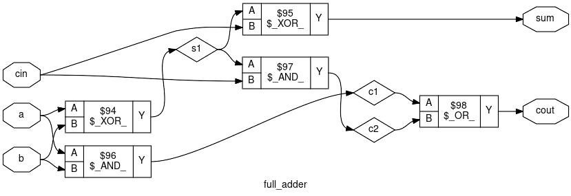

# Calculadora de 4 bits

Este proyecto implementa una **calculadora digital de 4 bits** diseñada en **Verilog** y sintetizada utilizando el flujo de diseño ASIC **OpenLane** con el **PDK Sky130**.

## Descripción

El objetivo del proyecto es demostrar el flujo completo de diseño digital, desde la descripción en RTL hasta la generación del layout físico de un circuito integrado.

La calculadora utiliza una arquitectura basada en **sumadores completos (full adders)** para realizar operaciones aritméticas básicas sobre números de 4 bits.

## Características

* Diseño en **Verilog HDL**
* Operaciones aritméticas de 4 bits
* Arquitectura basada en **Ripple Carry Adder**
* Síntesis lógica usando **Yosys**
* Flujo de diseño ASIC con **OpenLane**
* Tecnología **Sky130**

## Estructura del proyecto

```
calculator4bit
│
├── src
│   ├── calculator.v
│   ├── adder4.v
│   ├── subtractor4.v
│   └── full_adder.v
│
├── diagrams
│   ├── full_adder_clean.svg
│   └── calculator_rtl.svg
│
└── README.md
```

## Flujo de diseño

El flujo seguido en este proyecto es el siguiente:

```
Verilog (RTL)
   ↓
Síntesis lógica (Yosys)
   ↓
Diagrama RTL
   ↓
Diagrama a nivel de compuertas
   ↓
Implementación física con OpenLane
   ↓
Layout del circuito integrado
```

## Herramientas utilizadas

* Yosys – síntesis lógica
* OpenLane – flujo de diseño ASIC
* Sky130 – kit de proceso abierto (PDK)

## Diagramas del diseño

### Diagrama RTL de la calculadora


### Diagrama a nivel de compuertas del Full Adder



